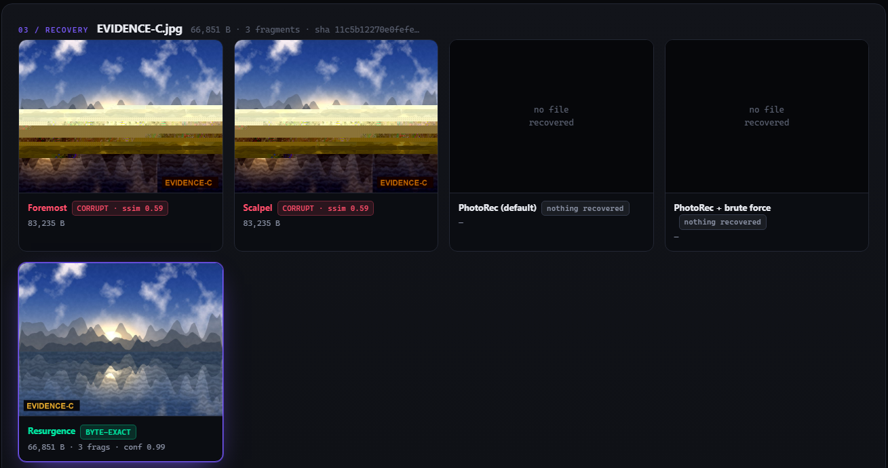

# Resurgence

**Recover files that should not be gone. Destroy files that should be. Prove both.**

A forensic toolkit for raw disk images. Its carver reassembles files whose
fragments are stored **out of order** on disk — the case where conventional
carvers return a corrupt file or nothing at all.



*One JPEG in three fragments with a backward jump. Foremost and Scalpel return
corrupt files; PhotoRec returns nothing; Resurgence returns the original byte for
byte.*

```bash
pip install -e .
resurgence-carve disk.img --out recovered/
```

---

## What it does

**Carving.** Finds file headers in unallocated space and searches for the
cluster sequence that reconstructs the original — including sequences that jump
backwards, which forward-scanning carvers cannot express. A JPEG entropy-stream
decoder acts as a hard constraint: candidates that desync, or that reach the
full MCU count without landing on the end-of-image marker, are eliminated
outright rather than down-weighted.

**Erasure.** Finds deleted-file residue that cluster-level wiping cannot reach —
resident file content and filenames surviving in unallocated NTFS MFT records —
and destroys it. Dry-run by default.

**Proof.** Issues a NIST SP 800-88r2 Appendix C certificate recording the
method, technique, validation verdict *and the residue paths that were not
checked*. Ed25519-signed, hash-chained, so removing or reordering a record is
detectable.

## What it does not do

Stated here rather than buried, because you would find it anyway:

- **It scores 0/6 on the NIST CFReDS fragmented-JPEG benchmark.** The true
  cluster paths are reachable — walking the ground-truth order decodes every
  file correctly — but the search picks wrong ones. The cause is measured and
  documented, not a bug awaiting a fix: on that corpus the data between
  fragments is photometrically indistinguishable from real image data.
- **It is the slowest tool that works.** Tens of seconds per file where
  conventional carvers take under two. Runtime at scale is unmeasured.
- **Baseline JPEG only.** Progressive JPEG is rejected explicitly rather than
  silently mis-decoded.
- **It can report success on a wrong reconstruction.** Measured on CFReDS:
  `oak-snow.jpg` returns `ok=True`, decodes every one of its 19,602 MCUs and
  lands on the end-of-image marker, yet the file is wrong — eight fragments
  instead of two, and 86 clusters belonging to a different image. The benchmark
  catches it by comparing hashes; a real case has no original to compare
  against. **Treat a success flag as a hypothesis, not a verdict.**
- **Confidence scores are uncalibrated.** `0.99` does not mean "99% of such
  files are byte-exact". Every surface that displays it says so.
- **Erasure never touches physical hardware.** ATA Secure Erase, NVMe Sanitize
  and crypto-erase are selected, validated and recorded as *planned*, never
  issued. Loopback image files only, enforced in code and covered by tests.
- **No learned model ships.** `model/` is a study of where learned adjacency
  helps; the carver does not use one. See *Prior art* below.

---

## Results

Same disk images, same scoring harness, real installed binaries for every
baseline. Reproduce with `./run.sh`.

### `hard.img` — one JPEG, three fragments, out of order with a backward jump

| tool | byte-exact | time | result |
|---|---|---|---|
| **Resurgence** | **1 / 1** | 32.5 s | **byte-exact** |
| PhotoRec + brute force | 0 / 1 | 0.6 s | nothing recovered |
| PhotoRec (default) | 0 / 1 | 0.5 s | nothing recovered |
| Foremost | 0 / 1 | 3.5 s | corrupt, ssim 0.59 |
| Scalpel | 0 / 1 | 0.6 s | corrupt, ssim 0.59 |

### `easy.img` — two JPEGs interleaved, fragments in order

| tool | byte-exact | time |
|---|---|---|
| **Resurgence** | **2 / 2** | 91.9 s |
| PhotoRec + brute force | 1 / 2 | 155.3 s |
| Foremost | 0 / 2 | 8.9 s |
| PhotoRec (default) | 0 / 2 | 1.0 s |
| Scalpel | 0 / 2 | 0.5 s |

**Read this honestly.** PhotoRec runs *with* `paranoid_bf` brute-force mode,
which exists specifically for fragmented JPEGs. On `easy.img` it recovers one
file byte-exact — slower than us, but exact. It fails on `hard.img` because its
search extends only **forwards** from the header, and there the next fragment
lies behind it. Benchmarking with that switch off would rig the comparison, and
anyone who knows the tool would catch it in one command.

Runtime is thermally variable on a laptop: across repetitions `hard.img` has
ranged 32.5–75.7 s for identical work. Treat single timings as indicative.

### Real photographs

The images above are generated, which was long the softest part of this
evidence. `resurgence-gen-real` builds the same layouts from real photographs,
with slices of *other* real photographs from the same camera as the surrounding
junk — same encoder, same settings, so competing fragments are maximally
confusable.

```bash
resurgence-gen-real --src ~/Pictures --out corpus/images
```

Two hand-placed layouts are not a rate, so `resurgence-success-rate` builds many
independent ones — randomising which photograph is the evidence, where the two
fragmentation points fall, how far the backward jump reaches, and how the
surrounding decoy photos are arranged — and scores each byte-exact.

> **30 / 30 byte-exact** over randomised three-fragment out-of-order layouts.
> Median 39 s per carve (22–82 s), 22 minutes total.

What that number does and does not cover: 20 photographs from **one camera at
one resolution**, one layout shape, and fragmentation chosen by this harness
rather than by a real filesystem. It is a far better claim than two hand-picked
images, and still not a claim about disks in the wild.

```bash
resurgence-success-rate --src ~/Pictures --n 30
```

---

## How it works

Carving runs at **4 KiB cluster** granularity, not 512 B sectors — real
filesystems allocate in clusters, so a 512 B unit multiplies the search graph
by 8× for no extra information.

**1. Format validator as a hard constraint.** `carve/validators/jpeg.py` is a
baseline JPEG entropy-stream decoder with resumable, snapshottable state. For a
candidate cluster it answers: *resuming Huffman decoding from exactly this bit
position, does the stream stay valid?* No IDCT — desync is the signal.

**2. Photometric seam scoring.** Huffman validity alone is weak: two JPEGs from
the same encoder share the standard Huffman tables, so a foreign fragment
decodes as valid symbols for hundreds of MCUs. The discriminator is the
**Pearson correlation between the candidate's first MCU row and the row
directly above it**, which lies in the previous fragment.

**3. Beam search with run merging.** Inside a fragment the successor is the next
cluster along and the correlation says so loudly, so a path extends without
branching. Only where that evidence fails — a genuine fragment boundary — does
it open into the full candidate set.

**4. Allocation prior, ablatable.** `LocalityPrior` (contiguous-first gap
distribution) against `UniformPrior` (the control). Run `--prior uniform` to get
the without-prior number. On `hard.img`:

| prior | result | MCUs | candidates | time |
|---|---|---|---|---|
| `locality` | **byte-exact** | 1900 / 1900 | 8,041 | **73.7 s** |
| `uniform` (control) | never closes the file | 1868 / 1900 | 158,452 | 1753.9 s |

Without the prior the search explodes: 19.7× the candidates, 23.8× the runtime,
and it still fails. The prior buys accuracy *and* speed.

## Findings that shaped the design

Each came from a failing test, and each is preserved as a comment at the
relevant place in the code:

- **Absolute |ΔDC| is the wrong metric and actively harmful.** DC is
  differentially coded, so a foreign fragment inherits the predecessor's
  predictor as a constant offset, and a flat fragment scores near-zero
  difference wherever it came from. Beam search found that exploit immediately
  and filled files with flat garbage. Correlation is offset-free.
- **The seam carries the evidence, not the fragment.** Averaging continuity over
  a whole candidate mostly measures "is this internally smooth?", which is true
  of every photograph.
- **The prior must not outrank the evidence.** At `W_PRIOR = 6.0` the contiguous
  bonus walked the search straight through a fragment boundary into filler. A
  prior that can overrule evidence just encodes the answer you wanted.
- **MCU count alone is not a terminator.** Huffman self-synchronises, so a wrong
  chain decodes 1900 valid-looking MCUs and stops on the counter. The scan must
  actually *end* at EOI.
- **Natural image statistics are load-bearing.** Procedurally-noisy test images
  gave 1.4× correct-versus-foreign separation; photographically plausible ones
  give 3.4×.

## SHA-256 discipline

Comparison against the original file lives in `bench/score.py` and nowhere else.
In a real case there is no original, so a carver that consults one is measuring
nothing. The separation is mechanical, not a matter of discipline.

---

## Install

Python 3.11+. The carver depends only on NumPy, Pillow and PyNaCl.

```bash
pip install -e .
```

Commands: `resurgence-carve`, `resurgence-erase-drive`, `resurgence-erase-metadata`,
`resurgence-erase-residue`, `resurgence-gen-corpus`, `resurgence-gen-real`,
`resurgence-bench`, `resurgence-success-rate`. The erasure commands are dry-run by
default and refuse anything that is not a regular file.

## Tests

```bash
pip install -e ".[dev]"
pytest -m "not slow"
```

Covers the decoder against truncation and foreign data, the priors and the
integrity of the ablation control, the cluster view, the certificate chain, and
the erase-side safety interlocks. Plain `pytest` adds end-to-end carves checked
byte-exact against ground truth.

## Reproducing the benchmark

Additionally needs Node 18+ for the UI and WSL Ubuntu with
`testdisk foremost scalpel` — the baseline carvers are Linux-only.

```bash
pip install -e ".[api,dev]"
npm install --prefix web
./run.sh
```

Then `python -m uvicorn api.main:app --port 8781` and
`npm run dev --prefix web` → http://localhost:5183. Ports are deliberately
non-default to avoid colliding with other projects' dev servers.

## Layout

```
carve/             cluster view, JPEG validator, allocation priors, beam search
erase/             sanitisation, residue detection, SP 800-88r2 certificates
corpus/generate/   disk image generators (synthetic and real-photograph)
model/             learned-adjacency study (not used by the carver)
bench/             scoring harness, baseline runners, success-rate measurement
tests/             pytest suite
api/ web/          FastAPI backend and React UI, live search trace over SSE
```

---

## Prior art — what is ours and what is not

Stated narrowly on purpose. Each item has a published owner, and overstating any
of them is how a project like this gets dismantled in thirty seconds.

**Sequencing is not ours.** Shanmugasundaram & Memon (2003) and Pal & Memon
(2006) framed reassembly as a maximum-weight path / k-vertex-disjoint path
problem and solved it greedily. Learned adjacency plus shortest path exists for
*image jigsaws* — Deepzzle (ECCV 2018), JigsawNet, DNN-Buddies.

**Out-of-order carving is not ours.** Huijsmans, Kuijsten, Jonker & van Beek,
*"How to Carve Out-of-Order Fragmented Files"*, LNCS 16365, Springer, 2026.
Their stated open problem — *efficiency in practical settings* — is what this
targets. They also report the empirical case for it: across 220 in-use Windows
laptops, **nearly half** of fragmented files were fragmented out of order.

**Fragmented JPEG carving has an established lineage, and it is not ours
either.** Ali, Mohamad et al. built `myKarve`, `X_myKarve` and `RX_myKarve`
(2015–2019) for fragmented and *intertwined* JPEG images, with a binary-search
fragmentation-point detector and, in the last of them, machine learning and
evolutionary algorithms in the reassembly stage. `JPGcarve` and van der Meer et
al.'s *"Recovery of heavily fragmented JPEG files"* (DFRWS 2016) attack the same
problem. Anyone claiming novelty in fragmented JPEG carving has to get past
these first.

**Concurrent work that overlaps substantially.** Waguespack, Richard III et al.,
*"Scalpel3: A High-Performance Data Carving Architecture for Recovery of
Fragmented Files"*, arXiv 2608.20363, 2026 — from the author of the original
Scalpel. It covers out-of-order block placement, JPEG validation by
Huffman-decoding one MCU at a time, reassembly heuristics informed by locality
and file structure, and learned models integrated via ONNX, evaluated over
80,000+ files. That is most of what this project's carver does, at far greater
scale. Its stated contribution is an extensible high-performance *architecture*
rather than a specific reassembly objective, which is where the distinction
lies — but the overlap is real and should be read before anyone claims a gap
that no longer exists.

**The fragmentation-point validator is not ours.** Van der Meer, van den Bos,
Jonker & Dassen, *"Problem solved: a reliable, deterministic method for JPEG
fragmentation point detection"*, DFRWS EU 2024. The quantization-array overflow
check is theirs; we reproduce their result exactly.

**Allocation priors are not wholly ours.** Karresand, Dyrkolbotn & Axelsson
(2019–2020) studied NTFS cluster allocation behaviour and named file carving as
an application. The narrower true claim: they use allocation behaviour to
prioritise *where* to search; here it is a fitted pairwise gap likelihood inside
the sequencing objective, with an ablation showing what it is worth.

**What is measured here.** The narrow claim is that no system learns *pairwise
adjacency between raw binary disk fragments* — checked against FiFTy
(classification only), FileScraper, JPEG-Restorer, JigsawNet and Deepzzle
(pixels, not bytes). Two pieces of adjacent work come close and should be read
alongside it: Lee et al., *"Byte-level generative predictions for forensics
multimedia carving"* (arXiv 2604.11010, 2026) applies a byte-level transformer
to carving, but as *next-byte prediction* on uncompressed BMP rather than
fragment adjacency; and `RX_myKarve` uses learning inside JPEG reassembly
without framing it as an adjacency model. The claim is only made where it was
measured working:

- **Documents and spreadsheets** — learned adjacency works. XLS 0.838, DOC 0.799
  AUC against near-negatives, both beating a byte-histogram baseline.
- **Compressed images** — no learned claim. JPEG entropy-stream 0.563, GIF
  0.476, *below* the same baseline. For these formats the contribution is the
  validator and the constrained search, and nothing else.

Two caveats travel with the document figures: single seed, and DOC/XLS are OLE
compound files, so some of what the model learns is likely container structure
rather than content adjacency.

**A measured limitation of the published validator.** Reproducing van der Meer
et al. against random data rejects 100% of wrong extensions within 4 KB, as
published. Replacing that random data with a real JPEG from elsewhere on the
same disk — the case multi-file carving actually faces — drops rejection to
51.8%, and to 19–38% for files without restart markers. Detection is solved;
discrimination among real candidates is not. Six files, one corpus; the
restart-marker explanation is inferred from correlation, not yet from a
controlled experiment.

**Why out-of-order is realistic.** Van der Meer, Jonker & van den Bos,
*"A contemporary investigation of NTFS file fragmentation"*, FSI:DI 2021 — across
220 real Windows laptops, a significant portion of fragmented files are stored
out of order.

## Why the gap still exists

NIST/CFTT publishes per-tool results on a standard fragmented-carving benchmark.
On fragmented JPEG, each of these carved files that *included the fill between
fragments* — the junk between fragments left inside the output:

| tool | version | tested |
|---|---|---|
| Magnet AXIOM | 7.5.0.37231 | Jul 2024 |
| FTK | 8.0 | Jan 2024 |
| Autopsy | 4.21.0 | Feb 2024 |
| R-Studio T80+ | 9.3.191230 | Jul 2024 |
| Forensic Explorer | 5.6.8.4340 | Mar 2025 |

X-Ways documents its own limitation: carving "generally assumes contiguous file
clusters, so it produces corrupt files in case the files were originally stored
in a fragmented way." EnCase 7.09.05 scored 10 of 40 viewable-complete plus
9,054 false-positive BMPs.

None of them reassembles. And note what the CFTT benchmark does *not* cover:
every layout is fragmented **in order**. Out-of-order is untested by the
government benchmark entirely — which is also why a 0/6 there and a working
out-of-order carver are not contradictory.

## Licence

MIT. See [LICENSE](LICENSE).
